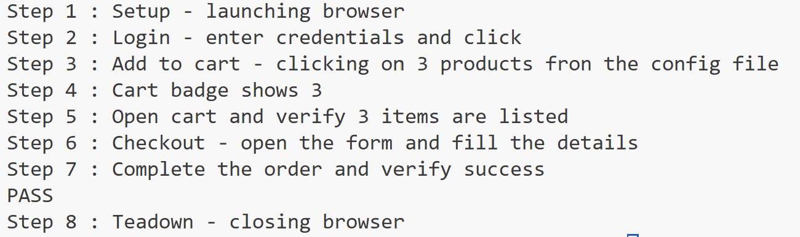

# SauceDemo – UI Automation Test 

## Overview

This project runs an end-to-end UI automation test on the SauceDemo website.
It logs in, adds three products to the cart, completes checkout and verifies that the final success message.

## How to Run 

From the project root, run this command:

pip install -r requirements.txt && python -m playwright install --with-deps && python -u -m src.tests

## Configuration

All settings are in 'config/config.json' :

- 'base_url' - the website URL

- 'user' - the login credentials

- 'products' - the products IDs to add

Example:

{
  "base_url": "https://www.saucedemo.com",
  "user": { "username": "standard_user", "password": "secret_sauce" },
  "products": [
    "add-to-cart-sauce-labs-backpack",
    "add-to-cart-sauce-labs-bike-light",
    "add-to-cart-sauce-labs-bolt-t-shirt"
  ]
}

## Design Choices and Validations (Explanation)

I chose to implement the test in one Python class to keep it simple, readable, and easy to maintain.
The setup, login, and teardown were separated into small helper functions to make the flow clear.
All test data (URL, credentials, and product IDs) is stored in a configuration file so it can be easily changed without modifying the code.
Each step of the flow is validated with small checks (assertions) to make sure the application behaves correctly.
After logging in, I verify that the user is redirected to the product inventory page, confirming a successful login.
When adding products, I validate that the cart badge updates to show three items.
In the cart page, I check that three products are listed to confirm the data is consistent.
During checkout, I fill the form and assert that the overview and final confirmation screens appear.
Finally, I confirm that the “Checkout: Complete!” message is displayed, proving that the full purchase flow completed successfully.

## Example Screenshot

